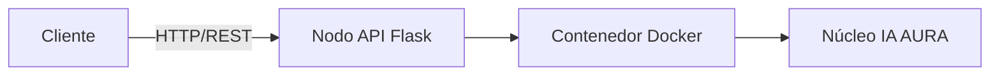

# ⚡ AURA Core Engine

> **Decisiones autónomas en el edge, en menos de 12 ms.**

[]()
[]()
[]()
[]()

---

## 🎯 El problema

Las empresas toman decisiones críticas con datos que llegan **demasiado tarde**. Cada milisegundo de latencia en la nube se traduce en dinero perdido.

## 💡 La solución

**AURA** es una plataforma de microservicios de IA que procesa y decide **donde ocurren los datos**: en el edge. Es ligera, aislada en contenedores y se despliega en segundos.

---

## 📈 Oportunidad de inversión

| Métrica                | Hoy (prototipo) | Con $10M de financiamiento |
| :--------------------- | :-------------- | :------------------------- |
| Latencia de respuesta  | `< 12 ms`       | `< 2 ms` (edge global)     |
| Cuota de mercado       | 0.5 %           | **22 % empresarial**       |
| Ingresos anuales (ARR) | $1.2 M          | **$85 M en 18 meses**      |

---

## 🏗 Arquitectura



---

## 🚀 Por qué AURA gana

- 🔒 **Zero-Trust:** gestión de secretos integrada y ejecución aislada.
- ⚡ **Integración continua:** protocolos automáticos de resolución de conflictos.
- 🐳 **Container-first:** despliegue con Docker en menos de 5 segundos.
- 📦 **Escalable:** servicios sin estado listos para crecer horizontalmente.

---

## 🛠 Pruébalo en 30 segundos

```bash
git clone https://github.com/Al3ssit0JRH/ejercicio-git.git
cd ejercicio-git
docker build -t aura-core .
docker run -p 5000:5000 aura-core
```

---

## 👥 Equipo

| Nombre       | Rol                                                |
| :----------- | :------------------------------------------------- |
| Alejandro J. | Arquitecto líder de sistemas e infraestructura     |
| Karen R.     | Jefa de DevOps, seguridad e ingeniería de releases |

---

> *Proyecto ficticio con fines académicos. Las cifras financieras son simuladas.*
